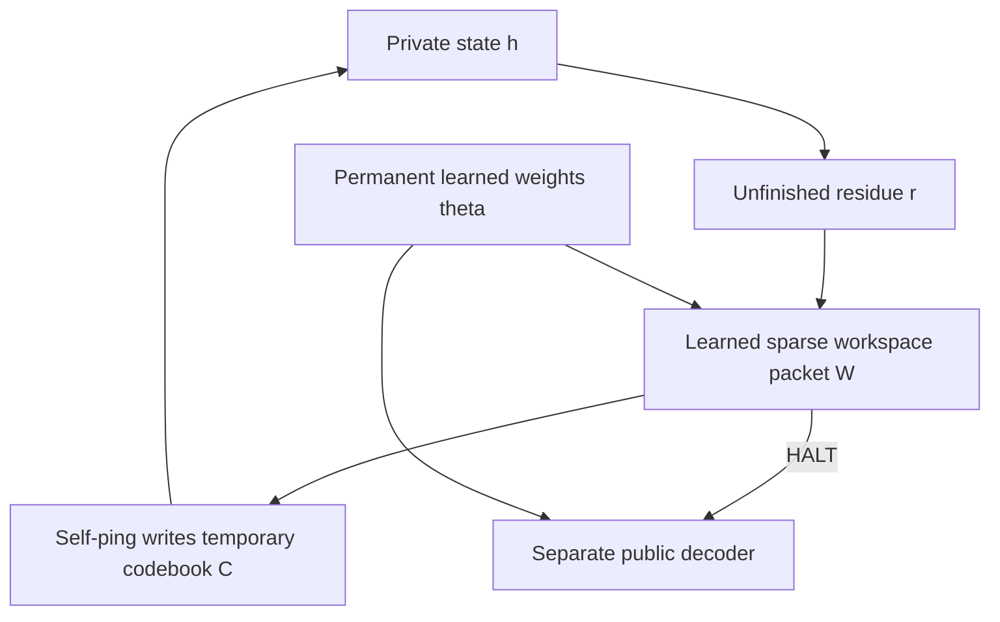

# Thingy

**A small trainable machine with an inspectable, writable, causal inner address channel.**

Thingy learns to emit self-pings into a temporary codebook. Those pings write a
fast operator; the next private state is read from that operator. A separate
learned decoder produces the public answer. You can watch the packets, edit one,
delete one, freeze its write, or interrupt the machine and restore selected state.

This is the first working instrument from Antti's October 6, 2026 discussion:
permanent codebook → temporary geometry → private computation → sparse workspace
→ self-address → changed computation. The focus is a measurable causal mechanism.

## Run it

Python **3.10 or newer**, CPU, NumPy. No API key or GPU is needed. A genuinely
trained **1,813-parameter checkpoint is included**; you can use the explorer immediately.

```bash
git clone https://github.com/anttiluode/Thingy.git
cd Thingy
python -m pip install .
python -m thingy serve --open
```

The explorer opens at **http://127.0.0.1:8765**. On Linux, use `python3` if that
is your Python command. On Windows, `run.bat` creates a virtual environment,
installs the package and opens the explorer. Linux/macOS: `bash run.sh`.

If the port is occupied: `python -m thingy serve --port 8766 --open`.

## Try the causal experiment

The initial little world is:

```text
Zapp means tired
tired helps rest
Zapp next cook
cook helps soup
```

The query is `Zapp means helps`. Press **Step once**:

1. The learned controller addresses `Zapp / means`.
2. Its packet writes the fast codebook; private state becomes `tired`.
3. The next packet addresses `tired / helps`; state becomes `rest`.
4. The controller emits `HALT`; the public decoder answers `I get rest.`

Reload the world and press **Wrong ping** first. The initial address changes to
`Zapp / next`, so the trajectory reaches `cook`, then `soup`. **Delete ping** and
**Freeze write** miss a computation while keeping the query timing fixed. The
default sparse world then reaches a missing binding and explicitly returns unknown.

To try interruption, save after the first step. Select **Codebook C** and
**Residue r**, keep “Clear facts and working state first” checked, and restore.
It can continue. Workspace plus residue has the current address but lacks the
facts needed for the next read. The matrix, private-state display and trace all
come from the engine's actual arrays and executed packets.

## Talk to its little world

Write one fact per line: `source relation target`. Relations are `means`, `next`,
`helps`, and `opposes`. A query starts with an object, followed by relation words
in the order you want applied. For instance:

```text
Facts:
helmet helps safe
safe next home

Query:
helmet helps next
```

The public answer is `home`. Rename objects or redefine their relations without
retraining. There can be up to **16 objects** and **32 query steps**. A query with
only an object asks for that object and triggers a silent zero-ping halt. Cyclic
facts are allowed; the requested chain length bounds the task.

The primary benchmark validates 0–6 steps. Longer accepted queries are
extrapolation in this task family. Review found that an unbounded length feature
could distort relation choices at 32 steps; the feature is now capped at the
four-step training range, while the host retains the complete unfinished query.
A post-review 100-world diagnostic at 32 steps passed; it is separate from the
predeclared primary benchmark.

Query aliases also learned during training:

| Relation | Query words |
|---|---|
| means | means, defines, is |
| next | next, after, follows |
| helps | helps, supports, aids |
| opposes | opposes, blocks, hinders |

This grammar is deliberately small. It is not a general conversational language
model. The object is decoded by learned weights; sentence wording is a fixed template.

## What actually learns

The permanent controller is a two-layer tanh neural network. A distinct linear
public head learns to decode the private state. Training uses **exact backpropagation
through continuous recurrent packet feedback**, implemented in NumPy and checked
against finite differences. Adam optimizes both heads.

Early training mixes in correct packets and uses auxiliary address supervision.
Both fade to **zero**. The final phase uses public-answer loss plus an internal
ping cost. Every training batch has fresh fact graphs. Evaluation uses independent
random streams and frozen permanent weights. Hard sparse packets are evaluated
separately from the soft training relaxation.

The parser, named address basis, episodic fact matrices, unfinished-query cursor,
and rank-one write rule are **engineered**. Promotion from arbitrary unstructured
private residue is not yet learned. The learned controller chooses relation
addresses and HALT inside this deliberately constrained task family.

## Measured results

Training seed 7, 1,000 batches of 64, chain lengths 0–4. Evaluation seeds
101/202/303, **420 independent fresh graphs per seed**, chain lengths 0–6.

| Condition | Combined exact results |
|---|---:|
| Sparse self-ping loop | **1,260 / 1,260** |
| Textual packet feedback | 1,260 / 1,260 |
| Continuous latent recurrence | 1,260 / 1,260 |
| One-read controller | 435 / 1,260 |
| Intact, multi-hop subset | 900 / 900 |
| Delete the first ping | 51 / 900 |
| Replace it with a wrong relation | 50 / 900 |
| Show the packet but freeze its write | 51 / 900 |
| Replay the correct packet from the original snapshot | **900 / 900** |
| Restore codebook + residue after interruption | 900 / 900 |
| Restore workspace + residue without facts | 0 / 900 |

The predeclared mechanism gate passed in all three evaluation streams. These
comparisons are **small controller ablations**, not four trained transformers.
Text and latent recurrence solve this simple world equally well: there is no
demonstrated accuracy advantage for the explicit workspace here. Its demonstrated
benefit is the ability to inspect, intervene on, and separately restore the channel.

Recovery of h from C+r is deliberately built into the state split. C stores all
episodic facts and the fast operator. This is not evidence of learned transcript
compression. The [primary report](results/REPORT.md) gives denominators, state
sizes, confidence intervals in its JSON receipt, and limitations; additional
streams are in [seed 202](results/seed-202/REPORT.md) and [seed 303](results/seed-303/REPORT.md).

## Commands

```bash
# Print the real internal packets and a separate public answer
python -m thingy demo
python -m thingy demo --intervention wrong
python -m thingy demo --random --hops 6 --seed 101

# Learn a new controller; this leaves the included checkpoint intact
python -m thingy train --seed 7 --steps 1000 --out runs/my-model

# Evaluate the included model, or explicitly select your newly trained one
python -m thingy benchmark --seed 101 --episodes 420 --out runs/benchmark
python -m thingy benchmark --model runs/my-model/controller.json --out runs/my-benchmark
python -m thingy serve --model runs/my-model/controller.json --open

# Verify gradients, causal interventions, snapshots, grammar, HTTP and CLI
python -m unittest discover -v
```

In this build environment, training took about five seconds with a single BLAS
thread. Your machine and BLAS library affect runtime; there is no heavy-model download.

The suite has 39 checks. The optional watch-control test uses Node 18+ and executes
the actual JavaScript handler against the real local engine with controlled timers.
Python/NumPy tests cover the engine without Node. See [verification details](docs/VERIFICATION.md).

## Architecture and next gates



See [the equations and implementation map](docs/ARCHITECTURE.md),
[the experiment specification](docs/superpowers/specs/2026-10-06-thingy-design.md),
and [the implementation plan](docs/superpowers/plans/2026-10-06-thingy.md).

The next research gates are harder: learn residue promotion without an explicit
query cursor, learn useful silence during ongoing computation, acquire richer
addresses from data, and compare matched-budget transformer/CoT systems on tasks
where recovery or workspace editing helps. A Jacobian lens on a real language
model is a separate experiment. Thingy does not claim consciousness or spontaneous
inner language.

MIT license. Original discussion and project: Antti Luode.
